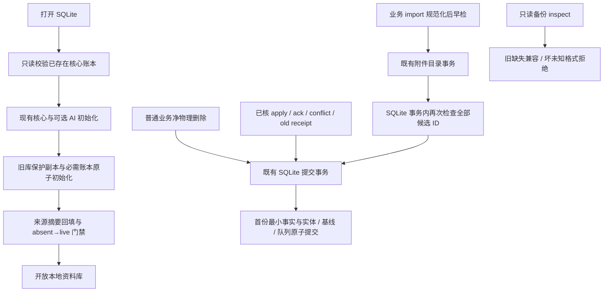

# AI-03-05C1：SQLite 已知删除事实与导入门禁

状态：C1 已实现，原固定候选 `17962d2` 已完成独立审查和作者本地验证；C1 真实 PostgreSQL、完整 CI 与合并门禁仍待后续。当前整合基线为 `be1ec9988f603c5b9df145240fa2579eced99909`（PR37 已合 main，精确 main CI `37086118576` 通过）。原实现及下述旧版本红证据基线仍为 `60309f566a690e1e808d52a41c2c9459b1db940f`，不把历史构建或测试转记到新候选。

本批在当前本地资料库保存已知永久删除事实，保护普通写入和业务快照导入。C2 才负责整库恢复前与活动库比较、合并事实及来源摘要；本批不宣称整库防复活或 LC34 全机回滚闭环。

## 最小合同

- `deletion_facts` 是独立、必需的核心扩展 v1，不依赖可选 AI。四列 `collection / entity_id / record_hash / record_json`，复合主键；三项 metadata 保存扩展版本、稳定本地 scope/owner 与覆盖起点。旧备份完全缺失扩展可读，半扩展、未知版本、坏表形状、坏 JSON/哈希/索引身份及 scope 不一致拒绝。
- 记录只含 collection/id、本地 scope/owner、观察身份和时间，以及本地 dataset/operation 或远端 origin/owner/正修订/可核 epoch；不保存正文、标题、摘录、附件路径、凭据或授权。首次事实不可覆写，不提供删除/裁剪接口。
- 普通本地业务事务与业务 import 的净物理移除，同事务写事实、实体、修订和 outbox；软删除、归档和撤回仍为 live 行。同步合并、别名规范化及 remote/copy 清理用独立 origin，不猜成本地 purge。
- 远端只有真实收到的 `value === null` 且正安全整数 revision，并且已核绑定 server origin/owner/epoch 才能记录。同事务覆盖 apply/ack、冲突及旧 operation-receipt 的 current/entries。缓存快路不能漏记；reset 缺席、null 修订不构成事实。
- 旧库仅在可信 persisted server/owner 绑定下补录留存正修订基线或明确冲突墓碑。基线缺少逐行 epoch 时保存 unknown；不从 local_revisions、无 origin 的旧 outbox、私有回执或缺席推断历史。覆盖标记始终承认升级前历史不完整。
- 启动先验证并准备账本，再生成/回填来源摘要。统一提交门禁阻止已知 ID 从 absent 变 live；允许已存在 live 行与远端删除冲突共存以及继续编辑。摘要 origin/alias 不是删除证据。旧二进制升级后的写入兼容性不受本批保证。
- 业务 import 在规范化后早检全部候选 ID，在提交事务内再次检查；借既有附件 rollback 回滚失败。import 不携带或替换本地账本。事实随 reset、断连、epoch 变化保留。
- 只读 backup inspect 校验账本格式；源备份不改写。此处仅格式校验，不能代替 C2 的当前事实/来源比较与恢复发布屏障。

## 验证边界

使用临时合成资料。先保存旧 HEAD 的关键失败证据，再验证本地删除同事务、重建拒绝、import 双检/回滚、启动迁移、远端明确事实与冲突共存、reset/alias/copy 不造事实，以及旧/坏扩展只读备份检查。真实 PG、全套 CI 和最终固定提交审查由后续统一门禁负责；不新增付费调用或部署。

## 实现结构

`sqlite-deletion-facts-contract.mjs` 拒绝未知版本、半扩展、坏 JSON/哈希/身份、额外 SQL 约束或索引、错误远端绑定等。`sqlite-deletion-facts.mjs` 是唯一账本写入器，只在既有事务中保存首份事实。升级保护副本权限为 0600；升级前 outbox/local_revisions 不能单独作为补录凭据。运行身份的 datasetId 与 AI epoch 可变化，稳定 scope 与已有事实保持。

同步事务保持 `sync-resolution` 来源；来源摘要迁移使用 `migration` 来源。两者仍经过重建门禁，但实体差异中的消失本身不生成本地永久删除事实。已经存活的远端删除冲突副本可以编辑；业务导入属于全量候选替换，仍检查全部候选 ID。

## 作者验证记录

- 基线 `60309f5` 的两个关键反例先失败：旧业务快照导入、普通领域同 ID 重建均缺少拒绝。实现后相同两例通过；分别保留 `local-red.log` 与 `local-initial-green.log`，不是 fixture 修正伪装红绿。
- `sqlite-deletion-facts.test.mjs` 10 项通过，包含净删除、软状态不造事实、最终提交故障、规范化 legacy 导入、重开/换代保持、可信旧 base/conflict 补录、保护副本和迁移失败回滚、启动摘要重建拒绝。
- `sqlite-deletion-facts-backup.test.mjs` 18 项通过，包含新账本、旧 v7/v3 无账本只读兼容、恢复副本迁移、15 类重签清单后的坏/未知格式，以及必须先于可选 AI 升级拒绝。源备份树哈希及当前实体/队列/事实/指针保持。
- `sqlite-deletion-facts-transactions.test.mjs` 4 项通过，使用真实 Mock 任务接纳和领域 purge、来源仓库两写入口、BEGIN 前注入事实验证事务内二检、真实附件目录已经替换后的失败回滚。旧 receipt 和 AI 任务保持，仅合成 Mock 调用。
- `sqlite-deletion-facts-sync.test.mjs` 12 项通过，使用真实 HTTP + JSON 服务端 + SQLite 设备：apply 提交失败原子回滚、三集合删除冲突与存活编辑、无效来源合并、v1/v2 旧回执、依赖冲突、重开/断连/换代/reset、缓存快路、copy 与 alias 来源区分。基线 `60309f5` 的另一个产品反例实际失败：HTTP 收到 note 的 revision=3/null，reset 清除基线后旧快照成功复活同 ID；保留 `sync-tests/baseline-remote-reset-red.log` 与 `final-green.log`。测试开发时的 fixture 失败另存，不计为产品红绿。
- 以上定向合计 44 项通过、0 跳过；`npm run build:web` 通过，仅现有大 chunk 提示。实际日志在本次执行环境 `/workspace/scratch/deletion-facts-validation/`。
- `npm run test:desktop` 首次完整执行 325 项：315 通过、8 失败、2 跳过，原日志 `desktop-full.log` 保留。8 个失败均在模块载入阶段遇到 `@prisma/client` 缺少 `Prisma` 导出，未进入测试体。恢复同版本 6.19.3 官方 `scripts/default-index` 原件后，仅补跑这 8 个文件，实际 17 项：7 通过、0 失败、10 PostgreSQL 跳过，见 `desktop-eight-load-retry.log`。两次覆盖的有效测试为 322 通过、12 跳过；不声称首次完整命令全绿。占位文件 SHA-256 为 `8036a2646bbf3d6de5fa2fae2b284f5d8900d1000c35531cad1a8f2b92c40589`，它不是已生成的数据库客户端，不提供 PG 执行能力；没有下载引擎、没有伪造导出。
- 未重复执行 API/V4 整套或真实 PG；跳过项仍待真实 PostgreSQL CI。固定候选独立审查、CI、expected-head 合并和精确 main CI 由后续统一门禁完成。

C2 尚未实现：本批 `prepareRestoredDirectory` 仅沿用格式检查与候选迁移，不对当前/候选账本和来源作 union，也不提供最终 drain 后事实复读及 pointer 屏障。不同独立根、全机回滚、升级前已丢失证据仍不由 C1 恢复。

## 固定候选独立审查修复

`900dae259dc81bbd713e52e7f224425368afedea` 审查发现 P2：账本误将内部元数据的 trim 相等、2048 字长度限制用于实体 ID，导致既有业务能够创建的 2049 字标签 ID，以及业务快照能够导入的首尾带空白 ID，在真实删除入口被拒绝。实体 ID 现与 `local-data-schema.js` 的共同合法域一致：必须是字符串且 trim 后非空；保存、哈希、SQL 键和重建门禁仍使用完整原串，不做 trim 或重新分配身份。scope、owner、dataset、operation 和远端 source 字段保持原有校验。

新增两例通过实际业务创建/导入、真实 deleteTag、同 ID 普通重建与业务 import 拒绝、重开后的事实回读验证。相同测试在修改生产代码前为 2 项失败（`identity-red.log`），修复后四个 C1 文件共 46 项通过、0 失败、0 跳过（`identity-fix-c1-green.log`）。先前构建与完整桌面回归属于 `900dae2` 作者候选证据；此窄修复仅重跑受影响的 C1 定向测试，未冒称重跑全套或真实 PG。

## 绿色主线整合验证

在 PR37 的精确 main `be1ec9988f603c5b9df145240fa2579eced99909`、tree `2fde4863f456391922d92845bfe67244926c1e87` 通过 CI `37086118576` 后，C1 正常 merge 该 main，不改写既有提交。9 个冲突均为机械的重叠改动：5 个 C1 未修改的 05B 文件采用精确 main；其余 4 个 C1 文件的 main 内容与原 `60309f5` 相同，保留已审 `17962d2`。相对 main 的差异仍严格限定于原 14 个 C1 文件；6 个生产文件和 4 个测试文件与 `17962d2` 逐字节一致，05B 的笔记嵌套 JSON 键序修复及回归原样带入。

同一 `node --test --test-concurrency=1` 命令执行四个 C1 文件与 `provenance-sync-contract.test.mjs`、`provenance-sync.test.mjs`：61 项通过、0 失败、0 跳过（C1 46 + 05B 15），日志 `main-integration-green.log`。`git diff --check origin/main` 通过。此轮没有重跑 build、完整 desktop/API/V4 或真实 PostgreSQL；新候选的完整 CI、最终审查、PR 与合并仍待后续门禁。
