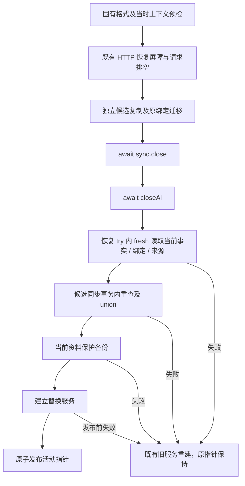

# AI-03-05C2：完整恢复删除事实与发布屏障

状态：C2 已实现，作者定向验证与固定候选证据见下文；独立审查、真实页面和新候选 CI 尚待统一门禁。本批从 C1 已合主线 `ee4849d4c8db02060f8c638a0e3250791fbec79a`、tree `43a36129510660988006d0edc15093a8df6e08fa` 开始；该基线精确 main CI `37089119842` 已通过。这是 C2 的旧行为红测基线，不是新实现已通过完整 CI 的证据。

本批在受控整库恢复中比较并保留当前与候选的已知删除事实，同时禁止同一存活知识条目的 recorded 来源被旧备份降级。继续使用已有备份检查、勾选及确认流程，没有新增确认步骤。

## 恢复合同

- `inspectRuntimeBackup` 默认只检查备份固有格式，独立目录导入、导出及草稿读取继续使用这个入口。运行时恢复预检另外传入当前上下文；合法包与当前资料不适用是恢复冲突，不能称为包损坏。预检成功只表示检查当时适用，最终决定仍在 owner 排空后重新读取。
- 预检和最终检查都对比全部核心集合的实际 live ID 与两侧事实并集，包括软删除但仍保留的主体。候选自身 live 与 remote tombstone 冲突也拒绝。历史 receipt、摘要 origin ID、草稿文本、旧授权及保留的附件物理文件不是额外主体，不作字符串扫描或自动删除。
- 当前 recorded 来源对候选仍存在的同一 artifact 必须保持相同 `provenanceHash`；候选确实不含该 artifact 时允许恢复。旧 schema 的合法 receipt 回填由 `sqlite-provenance-projection.mjs` 与真实启动共享，先形成相同的来源投影再比较，不能把临时 legacy 占位误判为降级；坏、无关或缺少 receipt 不获得历史身份。
- 两侧各自检查同步 origin/owner：任一侧只具其一或格式无效，明确拒绝；完整绑定不一致也拒绝。两个字段都缺才是未绑定。候选未绑定时保留当前完整绑定，当前未绑定时可接纳候选完整绑定；同步始终暂停，不复制当前凭据，不将本地 `demo` 推断为远端账号。
- 候选必须先使用自己的原绑定迁移、有限补录；再设置最终兼容绑定。原未绑定候选的正修订旧行不能借当前绑定变成有来源的删除事实。v1 尚无 `sync_conflicts` 表可只读投影，表在既有 v2 迁移时建立。
- 无冲突恢复采用当前稳定 scope、当前 `coverage.recordedSince`。任一侧标记历史不完整，合并后仍不完整。当前同 collection/id 的原始 `record_json` 和 `record_hash` 字节优先；仅候选独有事实映射 scope，重算观察身份与记录哈希，保留 ID 原字符、source 和时间，不伪造新删除事件。
- 备份 manifest 和原数据库的 datasetId 同时存在时必须相等，在候选轮换身份前检查；任一旧格式缺失仍兼容。不以未签名 manifest 证明外部 owner。恢复继续更换运行 datasetId、轮换 AI epoch 并隔离旧窗口，与稳定删除 scope 是不同职责。

## 提交与发布顺序

`restore-readiness.mjs` 提供内部快照、适用性检查和候选事务合并；快照不进入 HTTP 响应。`restore-directory.mjs` 负责隔离候选准备及最终落库。`runtime-server.mjs` 先完整等待同步和 AI owner，再在现有恢复失败处理 try 内重新读取当前状态；不持 SQLite 锁等待异步 owner，最终事务到指针发布之间不新增 await 写入窗口。合并失败只回滚候选；原库按现有流程关闭并重建服务，以恢复可用性。来源包始终只读，保护备份、附件、队列、草稿与旧窗口隔离保留。

仅以下可预期恢复冲突映射 HTTP 409；未知 scope、坏账本、未知内部错误不被泛化为可公开业务冲突，沿既有备份失败边界处理：

| code | 用户提示 |
| --- | --- |
| `LOCAL_RESTORE_DELETION_CONFLICT` | 备份包含当前已知永久删除的对象，不能恢复到当前资料；备份和原资料已保留。 |
| `LOCAL_RESTORE_PROVENANCE_CONFLICT` | 此备份会覆盖或降级当前已保存的来源事实，不能恢复到当前资料；备份和原资料已保留。 |
| `LOCAL_RESTORE_BINDING_CONFLICT` | 同步绑定记录不完整，无法确认此备份适用于当前资料；未切换资料。／备份与当前资料的同步服务器或账号不同，不能在当前资料中恢复；未切换资料。 |

既有 `BackupRestoreDialog` 将拒绝消息作为错误显示；预检拒绝时不出现成功确认区。失败不假称“完整性检查通过”。真实 desktop 的业务快照导入仍受原 policy 限制；本批未开放该入口。

## 作者证据与边界

全部使用临时合成 SQLite、真实本地 HTTP 与 Mock owner，不访问真实资料、账号或供应商。原日志位于本次执行环境 `/workspace/scratch/restore-facts-validation/`，测试开发的 fixture 失败与产品红测分开保留。

- 固定基线 `ee4849d` 的真实 HTTP 反例：创建标签、备份、永久删除后，当前账本已记录事实，旧 runtime inspect 与 restore 仍返回 200 并接受旧主体。`runtime-tests/baseline-red.log` 为 1 项失败；同一用例在实现后预检与恢复都返回专用 409，固有格式检查仍为 valid，来源树字节不变。
- 本轮实现审查发现只读 v1 预检误要求未创建的 `sync_conflicts` 表，定向 1 项实际失败后修复为 1 项通过；`v1-projection-red.log` / `v1-projection-green.log` 保留。该红测属于本轮新兼容性修复，不冒称旧主线产品红。
- 基础测试涵盖 union 原始字节、scope/coverage、提交故障回滚、候选自身冲突、可信及未绑定 legacy 观察、合法 receipt 同步投影、来源降级和缺失 artifact、manifest 身份及 v1 迁移。基础开发曾因造出已删除空间／未清理默认标签组失败，原日志保留，未计为产品红绿。
- 新增基础 9 项、真实 HTTP 19 项，以及原有 3 个 SIGKILL 边界的事实断言全部通过。HTTP 包含 partial 四方向、完整绑定兼容／不匹配、current 原字节优先、重启及二次旧备份拒绝、Mock 凭据不继承、final 事务与 pointer 故障。三个晚提交用例在已有指针下，于 `sync.close` 完成后的 `closeAi` gate 内分别提交删除事实、recorded 来源和 partial 绑定；最终均返回 409 并重建旧服务，指针、原逻辑数据、队列、附件字节、草稿及来源包保持。比较仅排除正常附件重新验证产生的 `verifiedAt` 派生时间，不排除实体或事实内容。
- 最终同一 `node --test --test-concurrency=1` 命令覆盖 21 个受影响文件：C2、既有备份／恢复／崩溃／传输／提炼预检、C1 账本与 SQLite store、来源启动和同步、AI 生命周期、runtime 与旧版本恢复，共 **210 项通过，0 失败，0 跳过**。日志 `targeted-regression.log`，精确命令 `targeted-regression-command.json`，作者归档 `author-evidence.json`；`git diff --check` 通过。
- 本轮没有构建生产前端、运行完整 desktop/API/V4 套件或真实 PostgreSQL；统一 CI 和生产页面验收由后续固定候选门禁负责。未将基线构建、C1 完整 CI 或历史失败转记为 C2 通过。测试作者的早期 fixture 名称长度、Mock 同步合同缺项、SQLite 行 prototype 与正常附件复验时间断言修正均保留原失败日志，不计产品红绿。

保证仅及本受控目标资料沿袭实际已知的事实。独立根、未观察离线设备、升级前丢失或无可信来源的历史、旧二进制写入及 LC34 全机连同事实库回滚仍未闭环；不引入外部权威事实导入、GC、保留期限、自动改 ID 或付费生成。
