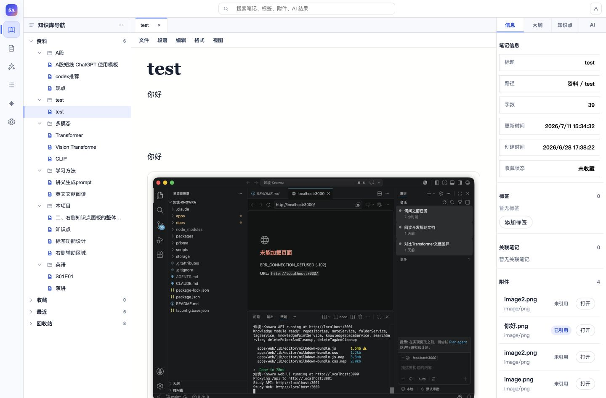
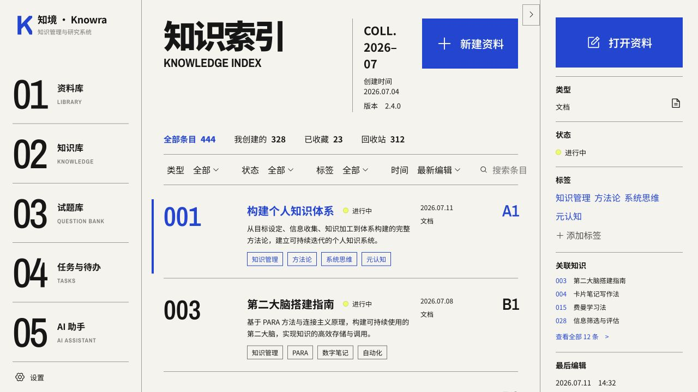
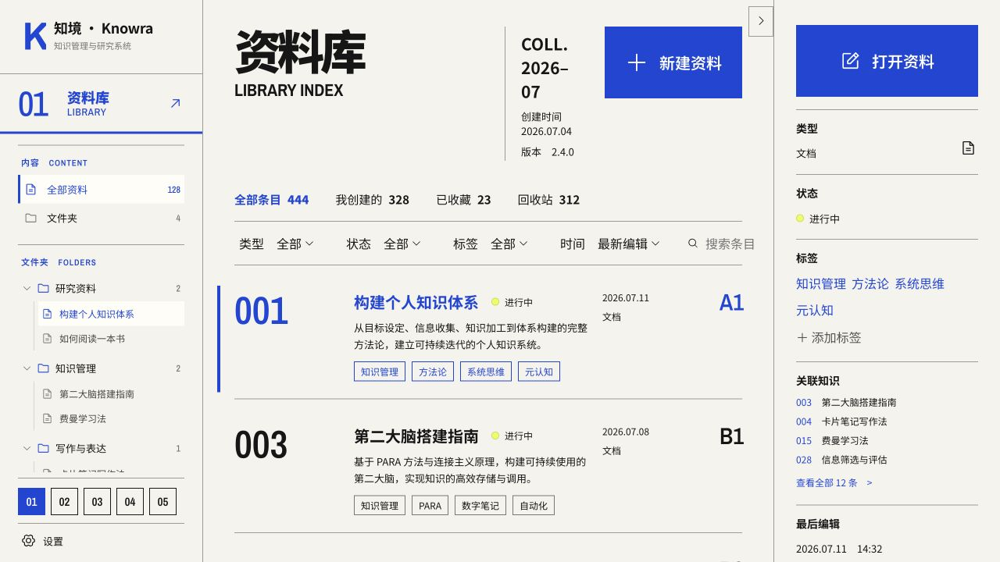
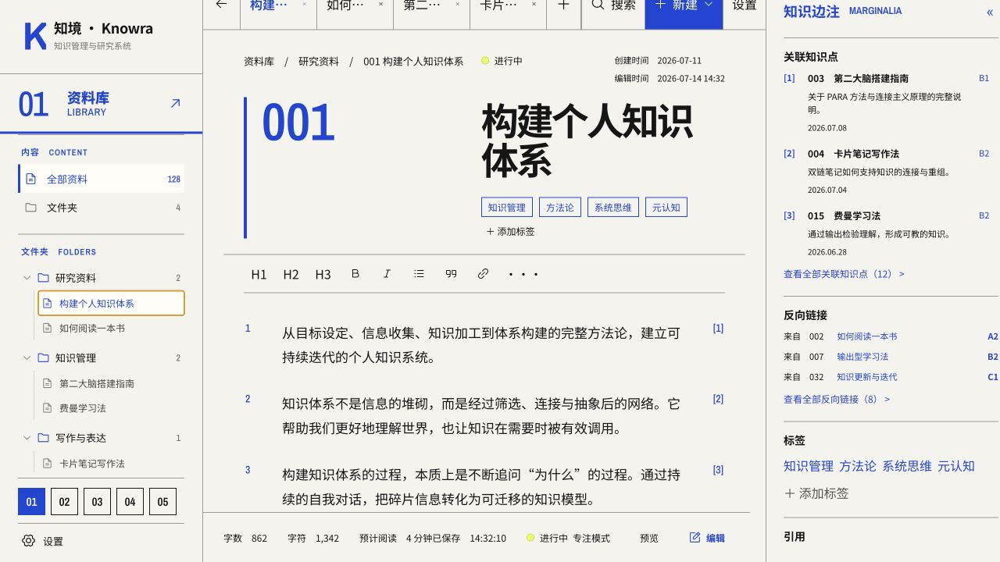

# Knowra UI 重构路线审查

日期：2026-07-15

## 1. 审查范围

- 原始视觉稿：《工作台（首页）》《资料库》；
- 当前共识：《Knowra 左侧导航栏设计说明》；
- 新 UI 测试 demo：默认索引、资料库目录态、编辑器态；
- 当前正式前端：知识库目录、Milkdown 编辑器、右侧信息与附件面板；
- 不采用已过时的《Knowra 前端视觉颗粒度对齐》作为依据。

审查以桌面端为范围；现有项目截图为 `1440 × 947`，demo 截图为 `1280 × 720`。`1440 × 1024` 与 `1280 × 800` 被列为下一阶段必须补齐的固定验收视口。

## 2. 总体判断

不建议直接把新 UI 整套套入正式项目后再打磨。

正式前端已经承载目录拖拽、右键菜单、多标签、标签、附件、导入导出、查找替换、图片、表格、快捷键、边注和持久化等真实能力。视觉规则尚未稳定时直接全面换壳，会把三类问题混在一起：

1. 设计本身仍在变化；
2. 正式项目布局与控制器需要迁移；
3. 真实功能可能发生回归。

同时，也不应把 demo 完整打磨成脱离真实项目的最终成品。demo 使用本地种子数据和 React state，不连接后端，也不包含真实 Milkdown 编辑器及其极端状态。过度精修 demo 会形成“原型正确、正式落地失真”。

因此建议采用中间路线：

> demo 先完成结构定稿，正式项目再按纵向切片逐步迁移，并在真实功能中完成最终打磨。

## 3. 分步证据

### Step 1：当前正式前端编辑器

健康度：**功能健康，视觉方向需要更换**。

观察：

- 已经具备真实目录、编辑器、右侧信息和附件能力；
- 当前浅蓝卡片式视觉与新 UI 的象牙白、钴蓝、黑色编辑网格不一致；
- 正式项目功能密度远高于 demo，任何布局迁移都需要功能对照表；
- 新 UI 不能只覆盖默认页面，还必须覆盖图片、表格、长文档、多标签和侧栏滚动等状态。

### Step 2：demo 默认全局索引

健康度：**视觉方向清晰，主区颗粒度尚未锁定**。

观察：

- 象牙白、钴蓝、近黑色、大编号与细分隔线已经建立辨识度；
- 默认模块导航的结构已经清楚；
- 主区信息密度低于原始参考稿，首屏只能稳定展示较少条目；
- 主区、详情栏和主要按钮的比例还需要统一，不宜直接视为正式设计。

### Step 3：demo 资料库目录态

健康度：**左侧结构基本健康，可以作为继续打磨的基线**。

观察：

- “模块默认态 → 固定目录位 → 底部模块切换”与当前设计共识一致；
- Logo、当前模块标题、目录滚动区、模块切换和设置入口的层级清楚；
- 仍需验证长文件名、深层目录、空目录和大量文件时的滚动行为；
- 选中态、展开态和目录密度需要在 `1280px` 与 `1440px` 两种宽度下共同确认。

### Step 4：demo 编辑器态

健康度：**流程可走通，空间分配和功能映射尚未成熟**。

观察：

- 左侧目录上下文能够保留，资料可以进入多标签编辑器；
- 在当前 `1280 × 720` 捕获状态下，标题已经出现明显换行，顶部标签区也较紧张；
- demo 工具栏、保存状态和边注只是概念交互，尚未映射现有 Milkdown 的完整能力；
- 编辑器主区、右侧边注和底部状态栏之间的空间分配必须在正式项目真实内容中再次验证。

## 4. 结构问题与视觉细节的区分

### 迁移前必须解决的结构问题

- 全局索引、模块目录、资料索引、资料编辑器四种壳层的关系；
- 左、中、右三栏的宽度规则与收起规则；
- 左侧目录滚动区和底部模块切换的固定关系；
- 编辑器标题、多标签、右侧面板同时存在时的最小可用宽度；
- 正式项目功能与新 UI 区域的一一映射。

### 可以进入正式项目后继续打磨的视觉细节

- 具体字号和行高；
- 分隔线灰度；
- 图标尺寸与光学对齐；
- hover、pressed 和轻量选中背景；
- 局部间距的 2～4px 微调。

## 5. 无障碍风险

- demo 目前没有为所有按钮统一提供明显的 `:focus-visible` 状态；
- 小号灰色英文与计数文字存在对比度风险；
- 部分图标按钮需要确认可访问名称和键盘顺序；
- 黄色状态点不能成为唯一的状态表达；
- 本轮截图不能证明屏幕阅读器、键盘操作、缩放和响应式重排符合要求。

## 6. 审查限制

- 本轮仅检查桌面端关键状态；
- 未完成移动端、200% 缩放、完整键盘路径和屏幕阅读器验证；
- demo 中部分按钮为视觉占位，不能用其交互完整度代表正式产品；
- 截图只支持可见布局判断，不代表完整 WCAG 合规。
