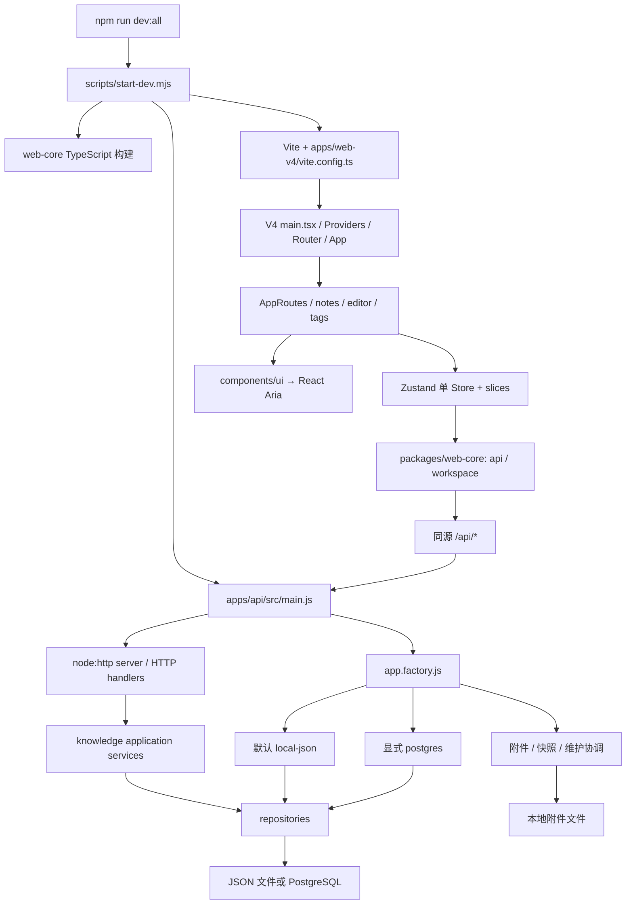
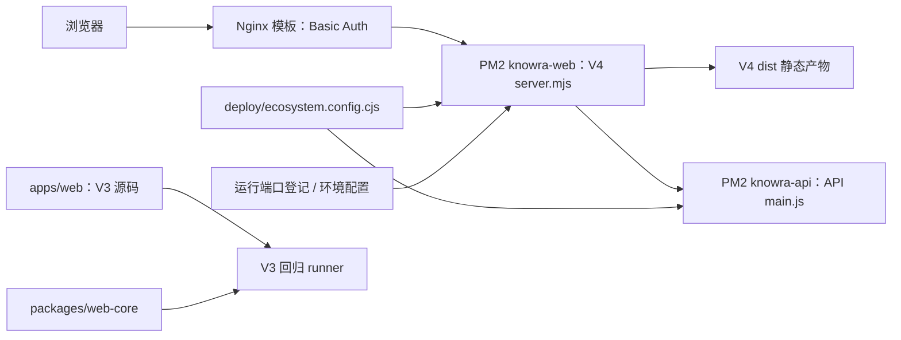

# 模块地图与依赖关系

基线：B2。箭头表示已核验的配置或源码依赖方向；图不代表所有运行分支已经执行。

## 1. 当前运行地图



`AppProviders` 将 API 与 storage 适配器注入 Store；业务源码通过 web-core 请求同源 API。Vite 开发代理与生产 Web 代理是两个实现入口，不是 UI 直接访问数据库。



注意：PM2 模板总会给 Web 设置 API_ORIGIN，因此覆盖 API 端口时不会自动回到运行端口发现路径，见 S2-01。这里的 Basic Auth 是仓库模板事实，不是生产服务器核验结果。

## 2. 入口索引

| 用途 | 入口与已核验方向 | 备注 |
| --- | --- | --- |
| 联合开发 | 根 `dev:all` → `scripts/start-dev.mjs` → web-core 编译 → API main → Vite | 脚本会使用根 storage/runtime 登记；隔离运行前需检查目录控制，不能直接在真实数据上执行 |
| API 开发/生产 | API package dev → `src/main.js` → factory 与 server；PM2 使用同一 main | `listenOnConfiguredPort` 默认 loopback；生产只尝试配置端口 |
| V4 开发 | predev 构建 core → Vite config → main.tsx | Vite 按配置与运行登记解析 API 端口 |
| V4 构建 | prebuild 构建 core → tsc --noEmit → vite build | 生产产物为 dist；本阶段未生成 |
| V4 生产 | `server.mjs` → `server/app.mjs` → 静态资源与代理 | 缺 dist/index.html 时显式失败；API_ORIGIN 优先 |
| 当前 UI | `main.tsx` → AppErrorBoundary/AppProviders/RouterProvider → App/AppRoutes | materials 接笔记、标签、编辑器；knowledge/training 等为门禁 |
| 单 Store | `store/createAppStore.ts` → status/navigation/notesIndex/workspace slices | UI 菜单等仍可用局部状态，不要求所有状态入 Store |
| 共享核心 | `packages/web-core/src/index.ts` → api/workspace；package 导出 dist | 源码关系映射不代替构建产物验证 |
| JSON | `createPersistentAppContext` → file-data-store → createAppContext → in-memory repositories + flush/runTransaction | 默认路径已确认；失败恢复需后续实测 |
| PostgreSQL | 显式 driver → postgres factory → Prisma runtime → async module/repositories | Prisma 动态导入；未启用时不连接数据库 |
| CI | npm ci --ignore-scripts → build:web → npm test → audit:prod | 未接 check:boundaries，见 S2-02 |
| V3 | package 仅 pretest/test；runner 自动搜集 test.js | 独立旧 bundle 脚本存在但未接当前启动链；不要自动删除 |

## 3. 文件归属覆盖

统计包含源码、配置、测试支持、文档和资源；每个文件只有一个主单元，交叉职责在阶段报告中引用。

| 单元 | 条目数 | 第二阶段工作 |
| --- | ---: | --- |
| C-01 根工程 | 7 | 清单/锁元数据、命令关系和版本 |
| C-02 V4 外壳/状态 | 37 | 入口/路由/Store 依赖、职责热点 |
| C-03 UI/样式 | 47 | Aria 边界、CSS Modules 与全局样式分区 |
| C-04 编辑器/浏览器 | 51 | 接线、依赖与职责热点，不验交互 |
| C-05 索引 | 21 | 查询/视图分页接线及全量拉取风险 |
| C-06 标签 | 7 | 目录/依赖及页面入口；业务规则待深入 |
| C-07 共享包 | 15 | 框架边界、API/workspace 导出和 shared 占位 |
| C-08 API 入口/HTTP | 25 | 入口、路由分发、响应/配置装配 |
| C-09 API 领域/应用 | 50 | 层间依赖、模块装配；规则逐项待深入 |
| C-10 JSON | 21 | 依赖方向、Schema 与事务入口 |
| C-11 PostgreSQL/Prisma | 44 | 可选装配与迁移目录，无数据库执行 |
| C-12 附件/快照/迁移 | 21 | 模块归属及共享规则引用；恢复待验证 |
| C-13 V3 | 342 | 遗留依赖图、当前入口隔离与职责候选 |
| C-14 测试 | 272 | 包含测试资产/配置；792 个 JS/TS 中的测试支持文件为 257 个 |
| C-15 脚本/服务配置 | 24 | 启动、端口、bundle 和部署脚本方向 |
| C-16 部署/CI | 4 | 代理/认证模板、PM2 配置及 CI 链 |
| C-17 文档/规范 | 212 | 包含阶段 1 证据；文档状态/链接和规则映射 |
| C-18 原型/资源边界 | 246 | 纳管文档原型/资源的归属；未枚举忽略目录 |
| 合计 | 1,446 | 未归属 0 |

每个文件的主单元、类别、大小及指纹见[文件覆盖](证据/阶段2/文件覆盖.json)。这张表表示静态覆盖，不表示每个文件都完成业务语义审查。

## 4. 依赖与分类例外

- 2,747 条字面量依赖中，相对目标均可定位；类型边与运行边分别检查，无非测试 SCC 环。
- V3 runner 有一处非字面量动态 import，输入来自同目录递归搜集的测试文件，属于明确的发现机制。
- `local-data-relations.js → formal-asset-validation.js`、`json-to-postgres.js / postgres-snapshot-service.js → note-content-policy.js` 是 3 条基础设施复用应用层纯规则的例外。当前未读出文件/网络执行依赖；阶段三评估是否应下沉为 domain policy，避免后续在纯规则内加入 IO。
- `scripts/build-milkdown-bundle.mjs` 通过字符串构造 V3 entryPoints，不出现在 import 图中，已人工补登记。说明 import 图不能代替全部可达性分析。
- NestJS、BullMQ 等包存在于 API 清单，但当前 API 静态源码没有对应导入；这是预留依赖，保留成本和漏洞适用性留到依赖专项，不误报运行框架。
- 未发现完全重复文件不等于没有同步/异步服务的语义分叉。JSON/PostgreSQL 的算法与错误语义仍需第三阶段逐项对照。
- 535 个非测试 JS/TS 中，41 个超过 250 行；候选完整列表在静态扫描证据。图标、Schema、迁移、映射、装配和旧页面不自动列为拆分问题。

## 5. 可复跑方式与边界

在仓库根目录、已有 `@babel/parser` 的环境中运行：

```bash
node docs/审查/证据/阶段2/static-audit.cjs
```

脚本只读取纳管文件并写本目录证据，调用现有只读边界检查；会覆盖同名阶段 2 扫描输出。后续需要保留 B2 时，先将脚本和输出另存到新阶段目录或新副本再运行，不覆盖原始证据。补充结构/样式检查与 PM2 纯配置推演的方法写在各 JSON 中；业务验证未执行。
