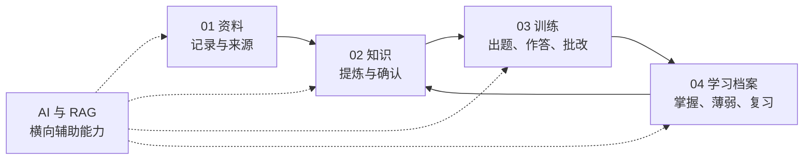

# Knowra 前端工作域与页面规划

> 文档状态：当前产品信息架构基线（2026-07-30 更新）
> 适用范围：一级工作域、页面归属、横向 AI/RAG 能力与长期前端演进
> 领域基准：[Knowra 知识与考卷系统领域冻结稿](Knowra%20知识与考卷系统领域冻结稿.md)

> 本文冻结的是用户可见的信息架构，不改变后端领域模块、事务边界或正式数据真源。此前“01 资料库 / 02 知识库 / 03 试题库 / 04 任务与待办 / 05 AI 助手”的五模块设想由本文替代。

## 核心结论

不再按“资料库 / 知识库 / 试题库”三个名词机械拆分。Knowra 按学习闭环划分为四个一级工作域：

| 一级工作域  | 用户心智                     | 对应领域                                                 |
| ----------- | ---------------------------- | -------------------------------------------------------- |
| 01 资料     | 我保存了什么                 | Note、NoteVersion、Annotation                            |
| 02 知识     | 我确认了什么知识、需要会什么 | KnowledgeItem、KnowledgeEvidence、LearningObjective      |
| 03 训练     | 我如何检验自己               | Question、Exam、Attempt、GradeResult                     |
| 04 学习档案 | 我现在会什么、下一步学什么   | LearningEvidence、MasteryState、Misconception、ReviewSchedule |

AI、RAG、搜索和知识图谱不应作为独立一级模块：

- AI 是贯穿四个工作域的助手。
- RAG 是后台检索能力，不是另一套“知识库”。
- 知识图谱是知识关系的可视化视图，不是独立数据来源。
- “题库”是训练模块里的资产管理页面，不需要独占一级模块。

这对应冻结稿的领域边界：Note、Knowledge、Assessment/Grading、Learning 是业务模块，Retrieval 和 AI 是横向能力。

## 页面规划

### 全局工作台

它不是第五个模块，而是四个工作域的聚合首页。

后期内容：

- 今天待复习
- 继续未完成训练
- 待确认知识候选
- 待复核题目
- 最近资料
- 薄弱目标
- 全局搜索与 AI 提问

工作台要后做。当前没有掌握度、复习计划和作答数据，过早建设只能依赖虚假统计。

### 01 资料

延续现有成熟的资料库体验。

- 资料索引：文件夹、搜索、标签、收藏、最近、回收站。
- 笔记编辑器：Markdown 编辑、预览、附件、大纲、标注。
- 来源与版本：查看 NoteVersion、来源状态和历史引用。
- 知识提炼边栏：只显示“与当前笔记有关”的候选知识和关联摘要。

建议把现在堆在“重要内容”边栏里的完整知识目标、题目编辑器移走。资料边栏只负责上下文操作：

- 从选区创建知识候选
- 查看本资料产生的知识
- 跳转来源
- 发起 AI 分析
- 根据本资料开始快速训练

### 02 知识

这是下一阶段最应该优先建设的独立工作域。

1. 知识概览

   展示候选、已确认、需修订、来源失效、缺少学习目标等真实状态，不展示没有数据依据的“掌握度”。

2. 知识单元

   中央为高密度列表，右侧为详情检查器。支持按状态、类型、来源健康度筛选。

   详情分为：

   - 核心陈述
   - 用户解释
   - 来源证据
   - 学习目标
   - 关联题目
   - 状态与变更

3. 学习目标

   跨知识单元查看全部目标，重点解决：

   - 哪些知识还没有可评测目标
   - 哪些目标仍是候选
   - 动作词与认知层级
   - 每个目标关联了多少题目

4. 审核队列

   统一处理：

   - 知识候选
   - 来源过期或失效
   - 需要修订的知识
   - 待确认学习目标
   - 因来源变化需要复核的题目

5. 知识关系与图谱

   延后到 `KnowledgeTopic`、`KnowledgeRelation` 落地之后。先提供关系表格和人工审核，再提供图谱视图，避免画出没有可靠语义的“漂亮网络”。

Phase2 已经提供 KnowledgeItem、Evidence 和来源回链；Phase3 已经提供 LearningObjective，因此前四个页面现在就具备后端基础。

### 03 训练

不再叫“试题库”，因为它最终不只是管理题目，还包含组卷、作答和批改。

当前可做：

1. 训练概览：题目状态、待审核题目、考试场景。
2. 题目库：题型、难度、状态、学习目标、来源筛选。
3. 题目编辑器：题干、选项、答案、评分量规、解析、多目标绑定、来源回链。
4. 考试场景：管理 ExamProfile 和 ExamFocus。

后端继续建设后再开放：

1. 练习生成器：选择知识范围、目标、题型、数量、难度。
2. 试卷库：蓝图、正式试卷、题目快照和版本。
3. 答题室：专注模式、题目导航、自动保存、提交确认。
4. 训练结果：得分、逐题批改、错误部分、来源复习。
5. 错题与重练：错题重做、变式练习、回到对应知识与原文。

当前 Phase3 后端已经支持题目、目标关系、来源和 ExamProfile/ExamFocus，但前端只开放了单一主目标和自动来源的最小交互。因此，独立题目库和考试场景页应当是近期前端重点。

### 04 学习档案

它承担“批改之后发生什么”，不等同于普通统计页。

未来页面：

- 今日复习
- 掌握状态
- 薄弱知识
- 错误认知
- 复习计划
- 学习记录
- 自我评估

这里必须清楚区分：

- 用户主观感受
- 系统证据判断
- 单个学习目标掌握度
- 聚合后的知识单元状态

在 `LearningEvidence` 和 `MasteryState` 开发前，不建议正式开放此模块，最多保留导航位置。

## 推荐开发顺序

| 阶段           | 前端交付                                                     | 后端依赖                                                    |
| -------------- | ------------------------------------------------------------ | ----------------------------------------------------------- |
| 资产工作台     | 四工作域、知识单元、学习目标、审核队列、题目库、题目编辑器、考试场景页；Phase3.1 已完成 | Phase2/3 正式资产与工作域查询已具备                         |
| 后端安全准入   | 不新增前端页面，仅保持既有工作域回归                         | [Phase3.2 后端一致性与安全准入](Phase3.2%20后端一致性与安全准入.md) |
| 训练执行       | 练习生成器、试卷库、答题室、作答记录                         | ExamBlueprint、Exam、Snapshot、Attempt、Response            |
| 批改与学习反馈 | 结果页、错题、掌握状态、薄弱知识、复习计划                   | GradeResult、LearningEvidence、MasteryState、ReviewSchedule |
| AI 与 RAG      | AI 提炼、AI 出题、AI 组卷、AI 批改、带引用问答、任务进度     | AIJob、ProviderGateway、Retrieval、Citation                 |
| 知识网络       | 关系审核、知识图谱、学习路径                                 | KnowledgeTopic、KnowledgeRelation                           |

[Phase3.2 后端一致性与安全准入](Phase3.2%20后端一致性与安全准入.md) 已完成，双驱动、owner、附件、正式资产和并发门禁已经统一。后续训练闭环拆成两段：

- Phase4A：先完成试卷、作答和不可变快照。
- Phase4B：再完成批改、学习证据、掌握状态和复习安排。

AI 生成可以在人工闭环稳定后接入，但生成结果仍必须进入候选或审核态，不能直接成为正式知识和正式题目。

## 页面形态原则

继续沿用现有 Swiss Editorial Grid，不重新发明视觉系统：

- 列表管理页：左侧模块目录、中部连续列表、右侧详情检查器。
- 编辑页：中部主编辑器、右侧来源与状态。
- 答题页：进入专注模式，弱化模块导航，突出题目、进度和自动保存。
- 结果页：左侧题目导航、中部作答与批改对照、右侧知识来源和下一步行动。
- 避免大量圆角统计卡片；使用规则线、编号、状态标记和高密度列表建立层级。
- 钴蓝只表示当前与可操作状态，荧光黄只用于少量待处理提醒。

## 当前实施边界

- Phase3.1 已将正式 SPA 收敛为资料、知识、训练、学习档案四个工作域，并把知识、目标和题目资产迁入独立工作台；
- Phase3.2 后端一致性与安全准入已完成，当前下一阶段为 Phase4A；
- 04 学习档案在 `LearningEvidence` 和 `MasteryState` 落地前只冻结导航位置，不展示虚假掌握度；
- 全局工作台、AI、RAG 和知识图谱均在具备真实后端数据后再开放；
- Phase4A 优先实现正式试卷快照、Attempt 与 Response，前端实现仍需单独规划和确认。
