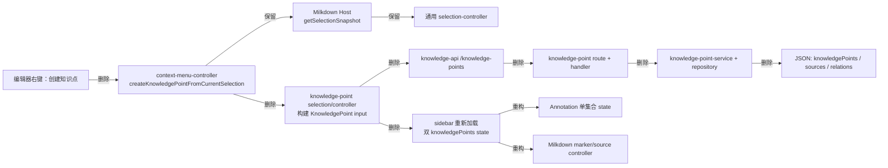

# 知识链路阶段 0：旧知识点退役审计

> 审计日期：2026-07-11  
> 对应方案：[知识链路开发方案](知识链路开发方案.md) §6  
> 结论：可以采用删除式替换；无需迁移脚本或旧 API 兼容期。

## 1. 审计范围与前置检查

- 已阅读项目开发规范、前端规范、项目结构导航、工程变更日志及知识链路开发方案。
- 已执行远端同步检查：`git fetch origin` 后，本地与 `origin/main` 没有彼此领先的提交。
- 工作区已有未提交的文档归档移动/删除改动；本审计及后续知识链路开发不得覆盖或混入这些改动。
- 阶段 0 只完成退役边界审计和实施计划，不新增 `KnowledgeItem`、`AssessmentPoint`、AI 或 RAG 功能。

## 2. 数据、缓存与导入导出结论

| 位置 | 结论 | 阶段 1 动作 |
| --- | --- | --- |
| `storage/data/knowledge-base.json` | `knowledgePoints`、`knowledgePointSources`、`noteKnowledgePoints` 均为空数组。 | 删除旧集合并新增 `contentAnnotations`；不迁移数据。 |
| `apps/api/storage/data/knowledge-base.json` | 同样均为空数组；仅为历史兼容位置。 | 不编写迁移脚本。 |
| 浏览器 workspace cache | 源码中未发现 `knowledgePoint(s)` 缓存字段。 | 无清理动作；新功能只将 cache 用作读取降级。 |
| `mock-knowledge-base.js` | 未发现旧知识点 mock 数据。 | 无清理动作。 |
| 导入/导出 | `file-data-store.js` 将旧集合原样纳入 snapshot。 | 在同一提交中替换 schema、默认状态和导入/导出测试 fixture。 |
| 测试 fixture | 仅 API/Web 自动化测试使用旧知识点记录。 | 删除旧测试，新增 Annotation fixture 与测试。 |

删除旧字段后，现有运行时数据可正常加载：当前 JSON 中没有需要读取或转换的旧记录。为避免无声丢失，阶段 1 可在开发环境对导入 snapshot 的非空旧集合返回明确错误；不应建立长期兼容 adapter，也不需要轻量清理脚本。

## 3. 实际旧调用链



切换后的入口应为：右键“标记为重要内容” → `getSelectionSnapshot()` → `POST /api/knowledge/content-annotations` → Annotation state → Annotation marker。右键菜单、编辑器 host、API client 和 controller 注册机制继续保留；业务名称与数据流全部替换。

## 4. DELETE：旧业务删除清单

### 后端

- `apps/api/src/modules/knowledge/domain/knowledge-point.js`
- `apps/api/src/modules/knowledge/application/knowledge-point-service.js`
- `apps/api/src/modules/knowledge/application/knowledge-point-tag-groups.js`
- `apps/api/src/modules/knowledge/infrastructure/knowledge-point-repository.js`
- `apps/api/src/modules/knowledge/http/knowledge-point-routes.js`
- `apps/api/test/knowledge-point-service.test.js`
- `apps/api/test/knowledge-point-http.test.js`

同时移除 `app.factory.js`、知识库模块 `index.js`、`knowledge-handlers.js`、`knowledge-routes.js`、`file-data-store.js`、`run-tests.js`、`knowledge-module.test.js`、`file-data-store.test.js` 与 `server-routes.test.js` 中仅服务旧模型的装配、集合、路由和断言。

### 前端业务、状态与事件

- `apps/web/src/controllers/knowledge-point-controller.js`
- `apps/web/src/controllers/knowledge-point/{state,selection,mutation,marker}-controller.js`
- `apps/web/lib/knowledge-points/{state,selection,form,filtering,panel-utils,panel,panel-renderers}.js`
- `apps/web/src/services/knowledge-api/knowledge-point-service.js`
- `apps/web/styles/components/knowledge-points.css`
- 旧知识点专属 Web 测试：`knowledge-point-*`、`v202-*`、`v203-*`、`v204-*`、`v205-*`，及其他测试中的旧分支断言。

从 `app-state.js` 删除 `knowledgePoints`、`allKnowledgePoints`、`knowledgePointTagGroups`、`knowledgePointFilters`、`knowledgePointAttachComposer`、`expandedKnowledgePointIds`、`knowledgePointEditing`。从 `sidebar-controller.js`、`app-controller-registry.js`、`event-bindings-controller.js`、`client.js`、`aside-events/{click,input,forms}.js`、`editor-content-events.js`、编辑器 controller 子目录和 `context-menu-model.js` 移除所有 `data-knowledge-point-*`、创建/编辑/挂载/删除/跳转分支。

## 5. REFACTOR：可保留但必须改写的编辑器能力

以下文件不能直接复用：

- `apps/web/lib/editor/milkdown/host/knowledge-point-source-controller.js`
- `apps/web/lib/editor/milkdown/plugins/knowledge-point-highlight-plugin.js`

原因是旧插件在 anchor 与 offset 失效后执行 `collectDocumentTextMatches(...)[0]`，会把重复文本静默定位到第一个命中。阶段 1 应重写为：

- `annotation-source-controller.js`：只负责向编辑器设置 Annotation、选中已解析范围。
- `annotation-highlight-plugin.js`：只渲染已确认范围并派发 `annotation-marker-click`；属性统一为 `data-annotation-id`。
- 独立 range resolver：依次验证保存范围、`quoteText + prefixText + suffixText + headingPath`，计算置信度；仅唯一高置信度结果可定位。低置信度或并列结果返回 unresolved，由 application/controller 将数据标记为 `stale`。

## 6. KEEP：已确认的通用能力

- `apps/web/lib/editor/milkdown/host/selection-controller.js` 的 `getSelectionSnapshot()` 与 `selectTextRange()`：属于通用编辑器 Host，不属于旧知识点内部。
- Milkdown Host 生命周期、`editor-factory.js` 的其他编辑器能力与 `milkdown-entry.js` 的通用入口。
- 统一 API client 与 `knowledge-api.js` 的门面模式。
- controller 注册、action proxy 与 event binder 架构。
- 侧栏通用 tab、附件、标签、大纲、独立滚动结构和现有设计令牌体系。

阶段 1 的选区 DTO 需要在通用快照基础上补齐 `headingPath`、`noteContentHash` 与 `anchorFingerprint`；这些是 Annotation 业务输入，不应重新把通用 selection API 绑回旧模型。

## 7. 阶段 1 第一批文件与装配入口

### 新增文件

```text
apps/api/src/modules/knowledge/domain/content-annotation.js
apps/api/src/modules/knowledge/application/content-annotation-service.js
apps/api/src/modules/knowledge/application/dto/content-annotation-dto.js
apps/api/src/modules/knowledge/infrastructure/content-annotation-repository.js
apps/api/src/modules/knowledge/http/content-annotation-routes.js
apps/api/test/content-annotation-*.test.js

apps/web/src/controllers/annotation-controller.js
apps/web/src/controllers/annotation/{state,selection,marker,mutation}-controller.js
apps/web/src/services/knowledge-api/content-annotation-service.js
apps/web/lib/annotations/{state,selection,panel,panel-renderers}.js
apps/web/lib/editor/milkdown/host/annotation-source-controller.js
apps/web/lib/editor/milkdown/plugins/annotation-highlight-plugin.js
apps/web/styles/components/annotations.css
apps/web/test/*annotation*.test.js
```

### 必改装配入口

```text
apps/api/src/app.factory.js
apps/api/src/infrastructure/file-data-store.js
apps/api/src/modules/knowledge/index.js
apps/api/src/modules/knowledge/http/{knowledge-handlers,knowledge-routes}.js

apps/web/src/{client.js,app/app-state.js,services/knowledge-api.js}
apps/web/src/controllers/{app-controller-registry,event-bindings-controller,sidebar-controller}.js
apps/web/src/controllers/editor/{context-menu-controller,draft-controller,host-controller,render-controller}.js
apps/web/lib/{editor/context-menu-model.js,events/aside-events/click.js,events/aside-events/input.js,events/aside-events/forms.js,events/editor-content-events.js}
apps/web/lib/editor/milkdown-entry.js
```

## 8. CSS、测试与文档清理

- 删除 `knowledge-points.css` 的加载与旧 marker class；在 Annotation 样式中仅使用既有设计令牌，不复制硬编码视觉值。
- 保留附件、标签、目录、通用侧栏和编辑器样式；清理 `components.css`、`milkdown-content.css`、`sidebar-lists-tags.css` 中只服务知识点的选择器。
- API 新增 domain、DTO、repository、service、HTTP、导入导出测试；Web 新增 state、选区输入、marker 唯一定位/失效、右键入口、侧栏、刷新后重载测试。
- 回归执行 `npm test`；并在切换完成后对人工源码运行旧标识扫描。除历史文档与变更日志外，`knowledge-point`、`knowledgePoint`、`knowledgePoints`、`knowledge-point-marker-click`、`data-knowledge-point`、`setKnowledgePointSources`、`selectKnowledgePointSource` 必须为零。
- 阶段 1 完成时同步更新 `docs/项目结构导航.md`、本方案状态与 `docs/工程变更日志.md`；按 SemVer 进行 MINOR 升版。

## 9. 小步提交顺序与回滚点

| 提交 | 内容 | 回滚点 |
| --- | --- | --- |
| 1 | Annotation 后端、JSON schema、API 测试；旧链路仍在。 | 回退此提交即可恢复旧数据模型。 |
| 2 | Annotation API client、state/controller、最小侧栏和测试；入口尚未切换。 | 回退此提交，后端不受影响。 |
| 3 | 新 marker 与可靠定位测试；旧 marker 仍可运行。 | 回退此提交，保留 Annotation CRUD。 |
| 4 | 将右键入口和侧栏切到 Annotation，执行端到端回归。 | 回退此提交，恢复旧 UI 入口。 |
| 5 | 删除旧 KnowledgePoint 全链路、CSS、测试和旧 JSON 字段；全局残余扫描。 | 此为不可兼容切换点；依靠提交 4 或完整数据备份回滚。 |

阶段 1 不得提前实现 `KnowledgeItem`、`KnowledgeEvidence`、`AssessmentPoint`、AI candidate 流程或 RAG 索引。
